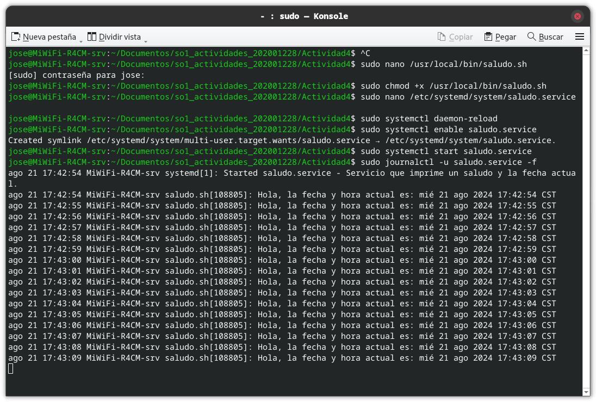

# Servicio Saludo

Este servicio imprime un saludo y la fecha actual cada segundo.

## Instalación

1. **Crear el script:**

   Crea el archivo `/usr/local/bin/saludo.sh` con el siguiente contenido:

   ```bash
   #!/bin/bash

   while true; do
     echo "Hola, la fecha y hora actual es: $(date)"
     sleep 1
   done
   ```

   - El while se lo dejamos en true, para que se siga ejecutando siempre
   - Donde echo es el mensaje que se le colocará
   - date es la función que muestra la fecha y hora actual
   - sleep 1 es el tiempo que se le da a la función para que se ejecute

   Guaradamos el contenido con el los comandos `ctrl+o` y salimos del arachivo con el comando `ctrl+x`

2. **Hacer el script ejecutable:**
   Para que el contenido del script se puede observar se realiza lo siguiente:

   ```bash
   #!/bin/bash

   sudo chmod +x /usr/local/bin/saludo.sh

   ```

3. **Cración de la unidad de systemd:**

   ```bash
   #!/bin/bash

   sudo nano /etc/systemd/system/saludo.service
   ```

   Nos redireccionará a una ventanda donde tendremos que colocar el siguiente codigo:

   ```bash
   #!/bin/bash

   [Unit]
   Description=Servicio que imprime un saludo y la fecha actual

   [Service]
   ExecStart=/usr/local/bin/saludo.sh
   Restart=always
   User=jose

   [Install]
   WantedBy=multi-user.target
   ```

Guaradamos el contenido con el los comandos `ctrl+o` y salimos del arachivo con el comando `ctrl+x`

4. **Habilitación del servicio(saludo):**
   Para que el servicio se ejecute al iniciar el sistema se realiza lo siguiente:

   ```bash
   #!/bin/bash

   sudo systemctl  daemon-reload
   ```

   Lo habilitamos para que se inicie automaticamente:

   ```bash
   #!/bin/bash

   sudo systemctl enale saludo.sevice
   ```

   Y por ultimo iniciamos el servicio para verificar si esta corriendo correctamente.

   ```bash
   #!/bin/bash

   sudo systemctl start saludo.service.
   ```

## Verificacion del script

Y por ultimo se ve la verificación de que el script este corriendo correctamente.


