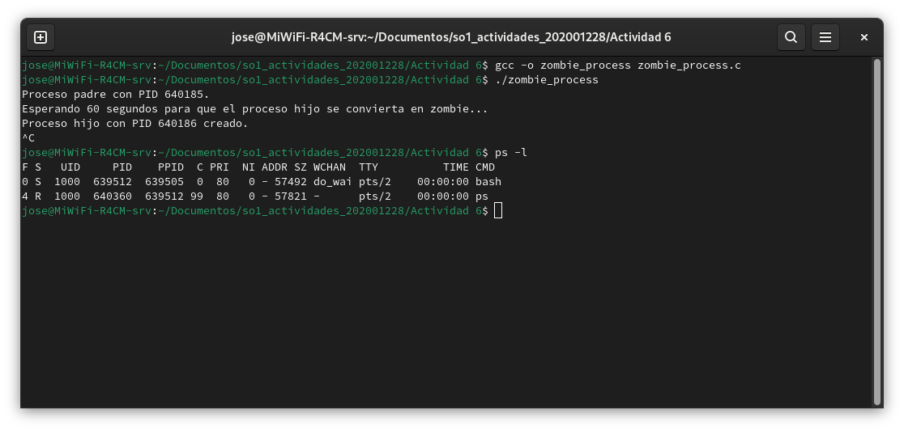

# Actividad 6

## Ejercicio 1

- El primer `fork()` crea un proceso, ahora un proceso adicional, el inicial y este.

- El segundo `fork()` se crean dos procesos más adicionales, ya serian 4 en total.

- El tercer `fork()` se ejecuta en todos los procesos existentes, esto crea 4 procesos mas, el total serian de 8.

La formula para calcular el numero de procesos creados es de `n`llamadas a `fork()` es $2^n$

## Ejercicio 2



## Ejercicio 3

- ¿Cuántos procesos únicos son creados? Se crearon 6 procesos unicos
- ¿Cuántos hilos únicos son creados? Se crearon 7 procesos en total.

Codigo Completo del ejercicio 3

```
#include <stdio.h>
#include <stdlib.h>
#include <unistd.h>
#include <pthread.h>

// Función para el hilo
void* thread_function(void* arg) {
    printf("Hilo creado en el proceso con PID: %d\n", getpid());
    pthread_exit(NULL);
}

int main() {
    pid_t pid;

    // Primera llamada a fork()
    pid = fork();

    if (pid < 0) {
        // Error al crear el proceso
        perror("fork");
        exit(EXIT_FAILURE);
    }

    if (pid == 0) {
        // Este es el proceso hijo
        printf("Proceso hijo con PID: %d\n", getpid());

        // Crear otro proceso desde el hijo
        fork();

        // Crear un hilo en el proceso hijo
        pthread_t thread;
        pthread_create(&thread, NULL, thread_function, NULL);
        pthread_join(thread, NULL);  // Esperar que el hilo termine
    }

    // Segunda llamada a fork() que se ejecuta en el padre, el hijo y el nieto
    fork();

    // Evitar que los procesos terminen inmediatamente
    sleep(2);

    return 0;
}

```
